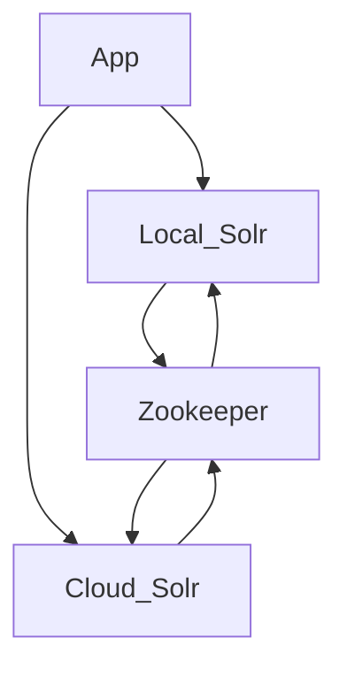

# Docker orchestration for UAL GOB (Geoblacklight) development

## Overview

Something to help me learn something about [GeoBlacklight](https://geoblacklight.org/)

**What is this?**

Here's a little diagram of GOB and Solr Cloud (WIP learning Mermaid syntax):



The GOB app container ("gob-test") _can_ have an instance of Solr that is started by default. The compose file starts up another Solr instance that is connected by ZooKeeper, which is the industry standard and probably better represents what production might look like.

## Setup

**1. Build the UAL-GOB Docker image:**

```shell
$ ./dbuild.sh
```

**2. Start the Docker network:**

```shell
$ ./start-me-up.sh
```

The GOB app is installed automatically if it does not already exist. This will take a little while and the server is still not started. A list of dependencies should print out as the GOB is installed.

The templated GeoBlacklight installation then defaults to downloading and starting a Solr server locally. This Docker orchestration also sets up Apache ZooKeeper to propagate the data in "cloud mode".

__NOTE:__ This will default to a container rebuild if the docker orchestration is already present.

All data that matters to the app is statefully preserved on the host machine in the `./ual_gob` directory. The GOB app will be in `./ual_gob/app` and all the Solr files and data will be in `./ual_gob/solr`.

## Optional application container commands

**Stop the Docker network:**

This is non-destructive. All containers remain stateful, as well as volumes and network.

```shell
$ ./start-me-up.sh pause
```

**Rebuild the containers:**

This rebuilds containers, so internal data that is not persisted on a volume will be destroyed. This is necessary for changes to the `docker-compose.yml` file to take effect.

```shell
$ ./start-me-up.sh
```

**Run Rake commands in the containerized application directory:**

```shell
$ docker exec -it gob-app bash -c -l './rake_command.sh "<command-to-run>"'

# Example - populate Solr test fixtures:
$ docker exec -it gob-app bash -c -l './rake_command.sh "geoblacklight:index:seed[:remote]"'
```

## Notes

* https://geoblacklight.org/tutorial/2015/02/09/create-your-application.html#install-geoblacklight
* https://github.com/geoblacklight/geoblacklight
* https://github.com/geobtaa/geoportal-solr-config
* https://solr.apache.org/guide/solr/latest/deployment-guide/zookeeper-ensemble.html
* https://github.com/docker-solr/docker-solr/tree/master/scripts

## Helpful hints

* Troubleshooting the Solr server is pretty easy with the logs mounted in `app/solr/server/logs`.
* Software versions are controlled in a couple files:
  * `dbuild.sh`
  * `docker/app/Dockerfile` or `docker/solr/Dockerfile`
* Unfortunately, the GOB Solr config has to live on the Solr instance, since it is a separate container. It is cloned there at container build time, so the container is run with it already in place. Therefore solr config code updates are necessary both in the GOB app container and the Solr container. TODO: change this to a mount if possible.
