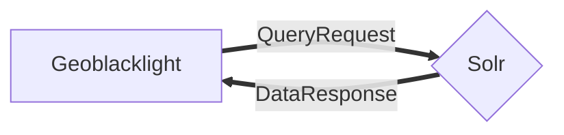

# Docker orchestration for UAL GBL (Geoblacklight) development

## Overview

This Docker orchestration runs a fully decoupled GeoBlacklight search service that uses a Blacklight (Ruby on Rails) application querying the Solr.

**How does it work? 30K ft view...**

Here's a little diagram of the GBL and Solr interaction (Mermaid syntax):



 The GBL app container queries the Solr instance directly. Using the "blacklight-core" metadata, Solr sends back its data response in a format that can be ingested by RoR models.

## Setup

### Necessary tools:

  - Computer (okay, sorry, it's Monday!)
  - Terminal access
  - Git
  - Docker, either Desktop or just the straight engine if deploying on any of the Linux distros
  - Lando

**Preliminary Steps:**

Start by cloning this repository to pretty much anywhere on most filesystems that the Docker daemon has access to.

**Build the UAL-GBL Docker images (for GBL and Solr containers):**

```shell
$ lando start
```

**Re-build image and containers while preserving volumes**

```shell
$ lando rebuild
```

**Ingest UAL OGM records from Github**

```shell
$ lando rake ual_docs:reindex
```

**Note**: If you're using Docker Desktop on a Mac, and encounter the following error: `ERROR ==> connect ENOENT /var/run/docker.sock`, try toggling the checkbox for `Allow the default Docker socket to be used (requires password)` and re-running `lando start`.

If you need to update the information in `match_table.csv`, be sure to also update the original spreadsheet in Sharepoint (link is available on the project's Redmine Wiki under "Project Resources".)

## Deployment

We use [Capistrano](https://capistranorb.com/) for deployments. Deployments are easiest to run through the Docker container for local development. You must provide the Slack webhook using the `SLACK_WEB_HOOK` environment variable in the `.env` file in order to deploy. You won't be able to deploy without it. You can find the webhook stored in [Stache](https://stache.arizona.edu) under the "Capistrano Slack App Webhook" entry. You must also provide the path to your SSH key in the `DEPLOY_SSH_KEY_PATH` environment variable in `.env`. **It must be an RSA or ED25519 key**. Lastly, the deployment is executed as the 'deploy' user, so you must have your SSH public key added to the deploy users `authorized_keys` file.

Here are the steps to deploy to production:

0. Make sure you're on the Library network (on site or using VPN)
1. Run the Capistrano deployment command

    ```shell
    lando cap production deploy
    ```
    This will deploy the `main` branch to production. Alternatively you can provide a branch name to deploy:
    
    ```shell
    lando cap production deploy BRANCH=some_branch_name
    ```

You can check the status of the deployment in the `#tess-dev-deployer` Slack channel in the UAL Slack workspace.

## Optional application container commands

**Stop the Docker network:**

This is non-destructive. All containers remain stateful, as well as volumes and network.

```shell
$ lando stop
```

**Run Rake commands in the containerized application directory:**

```shell
$ lando rake "<command-to-run>"

# View all available rake tasks
$ lando rake --tasks

# Populate default Solr test fixtures:
$ lando rake "geoblacklight:index:seed[:remote]"

# Clear current Solr index:
$ lando rake "ual_docs:clear_index"

# Ingest UAL test docs:
$ lando rake "ual_docs:load_test_docs"

# Clear current Solr index and ingest all UAL GeoBlacklight metadata from Github:
$ lando rake "ual_docs:reindex"
```

See Geoblacklight tasks [here](https://github.com/geoblacklight/geoblacklight/blob/main/lib/tasks/geoblacklight.rake).

- `:geoblacklight` main namespace for all commands.
  - `:server` Solr & Geoblacklight startup (which this repo doesn't use). This also installs some seed data.
  - `:webpack` Runs the app and Solr together in interactive mode with the `foreman` gem.
  - `:index` child name for running fixtures.
    - `:seed` by itself runs local fixtures (spec/fixtures/solr_documents).
      - `[:remote]` reaches out to the github repo (see below) to get fixtures.
    - `:ingest_all` Ingests a GeoHydra transformed.json.
    - `:ingest` default to ingest blacklight.json files from directory `data` in project root.
      - `[:directory]` to pass a directory path to ingest files.
  - `:downloads` stuff to do with downloading files.
    - `:delete` deletes cached downloads.
    - `:mkdir` create the cache directory, like bash.
    - `:precache` programmatically add cache files.
  - `:solr:seed` same as `geoblacklight:index:seed`
  - `:application_asset_paths` echoes out all asset paths, kinda handy.

**Inspect GBL application logs for development**

```shell
# number of lines to watch can be set
$ lando logs
```

**Run Solr queries for development and testing**

```shell
$ ./make-solr-query.sh <query-something-neat>

# Example (after running seed ingest) - look for geo data containing "Manhattan":
$ ./make-solr-query.sh "q=Manhattan"
```

Also see the Solr query screen in the Solr admin: https://solr.apache.org/guide/solr/latest/query-guide/query-screen.html. Scroll to the main, lefthand menu. Click on the collection, "blacklight-core". Then scroll down to the query button.

**Tear-down**

WARNING: This destroys _all_ data, meaning containers and volumes. (It does not remove Docker images, however.)

```shell
$ lando destroy
```

This does not remove images. If you want to remove images you can run `docker image prune -a` wich will **remove all unused images**. 

To also remove any app related files that are not code (tmp directory files, SQLite file, etc) you can run:

```shell
./rm_app_files.sh
```

## Re-indexing metadata

We keep all the GeoBlacklight metadata docs in the [ual-geospatial-metadata](https://github.com/ualibraries/ual-geospatial-metadata) repository (private repo currently). We have a rake task for clearing the current core docs and reingesting the docs from the ual-geospatial-metadata repository.

### Reindexing locally

```shell
lando rake "ual_docs:reindex"
```

### Reindexing in production

You can use capistrano to run the same rake task in production:

```shell
lando cap production invoke:rake TASK=ual_docs:reindex
```

## Notes

* https://geoblacklight.org/tutorial/2015/02/09/create-your-application.html#install-geoblacklight
* https://github.com/geoblacklight/geoblacklight
* https://github.com/geobtaa/geoportal-solr-config
* https://github.com/projectblacklight/blacklight
* https://github.com/docker-solr/docker-solr/tree/master/scripts
* https://github.com/geoblacklight/geoblacklight/tree/main/spec/fixtures/solr_documents
* https://github.com/OpenGeoMetadata/edu.berkeley/blob/master/ark28722/s7/059k/geoblacklight.json (example geoblacklight.json file in GBL ver.1 schema)
* https://opengeometadata.org/ogm-aardvark/ (for GBL ver.2 schema)
* https://opengeometadata.org/aardvark-gbl-1-crosswalk/
* https://github.com/projectblacklight/blacklight/tree/main/lib/blacklight/solr (Solr classes)

## Helpful hints

* Blacklight-core metadata and config are stored in the `solr/conf` directory, which is mounted into the Solr container.

## Rails Console
To access rails console run `lando rails c` to fire up the console

### Helpful Rails Console Commands

| Command | Purpose |
| ------- | ------ |
| `reload!` | Refresh the build (clear cache) |
|  |  |
