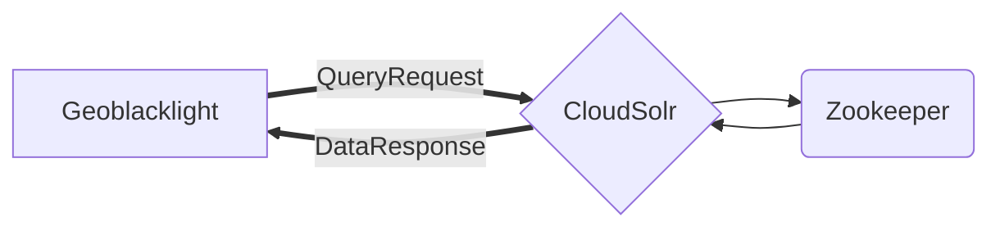

# Docker orchestration for UAL GBL (Geoblacklight) development

## Overview

This Docker orchestration runs a fully decoupled GeoBlacklight search service that uses a Blacklight (Ruby on Rails) application querying the Solr & ZooKeeper middleware "ensemble".

**How does it work? 30K ft view...**

Here's a little diagram of the GBL and Solr Cloud interaction (Mermaid syntax):



 The GBL app container queries the Solr instance directly. "Sharding" information is managed by the ZooKeeper middleware. Using the "blacklight-core" metadata, Solr sends back its data response in a format that can be ingested by RoR models.

## Setup

### Necessary tools:

  - Computer (okay, sorry, it's Monday!)
  - Terminal access
  - Git
  - Docker, either Desktop or just the straight engine if deploying on any of the Linux distros

### Preliminary Steps:

Start by cloning this repository to pretty much anywhere on most filesystems that the Docker daemon has access to. There may be filesystem permission issues for your user. Either find your user's UID and GID or ask another IT compadre if they know what the heck I'm talking about. Put those ids in the `.env` file at the root of the project, replacing the UID and GID, respectively. Then proceed to ...

**1. Build the UAL-GBL Docker images (for GBL and Solr containers):**

```shell
$ ./dbuild.sh
```

**2. Start or rebuild the Docker network:**

```shell
$ ./start-me-up.sh
```

The GBL app is installed automatically if it does not already exist. This will take a little while and the server is still not started. A list of dependencies should print out as the GBL is installed. All data that matters to the app is statefully preserved on the host machine in the `./app` directory. The GBL RoR app will be in `./app/app` (Yes, two apps for the price of one!)

Build scripts set up Apache ZooKeeper and Solr decoupled to propagate search configuration and data in "cloud mode". Search data is located in Docker volumes on startup.

**3. View application and service admins:**

See the following URLs:

| URL | Service |
| --- | ------- |
| `gobapp.localhost:3000` | GeoBlacklight app |
| `gobapp.localhost:8983` | Solr admin (admin is locked down; see the .env file for creds) |
| `gobapp.localhost:8881/geoserver` | Geoserver backend (see geoserver docs for creds) |
| `gobapp.localhost:8087` | PGAdmin GUI (see docker/postgis/docker-compose for creds) |
| `127.0.0.1:8089/dashboard/` | Traefick proxy dashboard |

## Optional application container commands

### Stop the Docker network:

This is non-destructive. All containers remain stateful, as well as volumes and network.

```shell
$ ./start-me-up.sh pause
```

### Start the Geoserver orchestration

This starts the GeoServer and Postgres containers. These orchestrate the functionality necessary to load layers in the Geoblacklight map windows, as well as downloading map layers. See [docs](./docs/geoserver-setup.md) for more info on setup.

```shell
$ ./start-me-up.sh geoserver
```

### Run Rake commands in the containerized application directory:

```shell
$ docker exec -it gob-app bash -c -l './rake_command.sh "<command-to-run>"'

# Populate default Solr test fixtures:
$ docker exec -it gob-app bash -c -l './rake_command.sh "geoblacklight:index:seed[:remote]"'

# Ingest UAL test docs:
$ docker exec -it gob-app bash -c -l './rake_command.sh "ual_docs:load"'

# Ingest all UAL OGM records from Github:
$ docker exec -it gob-app bash -c -l './rake_command.sh "ual_docs:migrate"'
```

See Geoblacklight tasks [here](https://github.com/geoblacklight/geoblacklight/blob/main/lib/tasks/geoblacklight.rake).

- `:geoblacklight` main namespace for all commands.
  - `:server` Solr & Geoblacklight startup (which this repo doesn't use). This also installs some seed data.
  - `:webpack` Runs the app and Solr together in interactive mode with the `foreman` gem.
  - `:index` child name for running fixtures.
    - `:seed` by itself runs local fixtures (spec/fixtures/solr_documents).
      - `[:remote]` reaches out to the github repo (see below) to get fixtures.
    - `:ingest_all` Ingests a GeoHydra transformed.json.
    - `:ingest` default to ingest blacklight.json files from directory `data` in project root.
      - `[:directory]` to pass a directory path to ingest files.
  - `:downloads` stuff to do with downloading files.
    - `:delete` deletes cached downloads.
    - `:mkdir` create the cache directory, like bash.
    - `:precache` programmatically add cache files.
  - `:solr:seed` same as `geoblacklight:index:seed`
  - `:application_asset_paths` echoes out all asset paths, kinda handy.

### Inspect GBL application logs for development

```shell
# number of lines to watch can be set, defaults to 10
$ ./inspect-app-logs.sh 50
```

### Run Solr queries for development and testing

```shell
$ ./make-solr-query.sh <query-something-neat>

# Example (after running seed ingest) - look for geo data containing "Manhattan":
$ ./make-solr-query.sh "q=Manhattan"
```

Also see the Solr query screen in the Solr admin: https://solr.apache.org/guide/solr/latest/query-guide/query-screen.html. Scroll to the main, lefthand menu. Click on the collection, "blacklight-core". Then scroll down to the query button.

### Tear-down

WARNING: This destroys _all_ data, meaning containers and volumes. (It does not remove Docker images, however.) The dialogue will ask if you want to clean up any untracked files. Usually there are generated files that are ignored by git. However, if you have added something and not committed, those files may be deleted permanently. Please take a good look at the list to avoid this.

```shell
$ ./destroy.sh
```

## Notes

* https://geoblacklight.org/tutorial/2015/02/09/create-your-application.html#install-geoblacklight
* https://github.com/geoblacklight/geoblacklight
* https://github.com/geobtaa/geoportal-solr-config
* https://github.com/projectblacklight/blacklight
* https://solr.apache.org/guide/solr/latest/deployment-guide/zookeeper-ensemble.html
* https://github.com/docker-solr/docker-solr/tree/master/scripts
* https://github.com/geoblacklight/geoblacklight/tree/main/spec/fixtures/solr_documents
* https://github.com/OpenGeoMetadata/edu.berkeley/blob/master/ark28722/s7/059k/geoblacklight.json (example geoblacklight.json file in GBL ver.1 schema)
* https://opengeometadata.org/ogm-aardvark/ (for GBL ver.2 schema)
* https://opengeometadata.org/aardvark-gbl-1-crosswalk/
* https://github.com/projectblacklight/blacklight/tree/main/lib/blacklight/solr (Solr classes)

## Helpful hints

* Software versions are controlled in `.env`, as are a few other important environment variables.
* Blacklight-core metadata and config are stored in the `app/solr/conf` directory, which is mounted into the Solr container.
