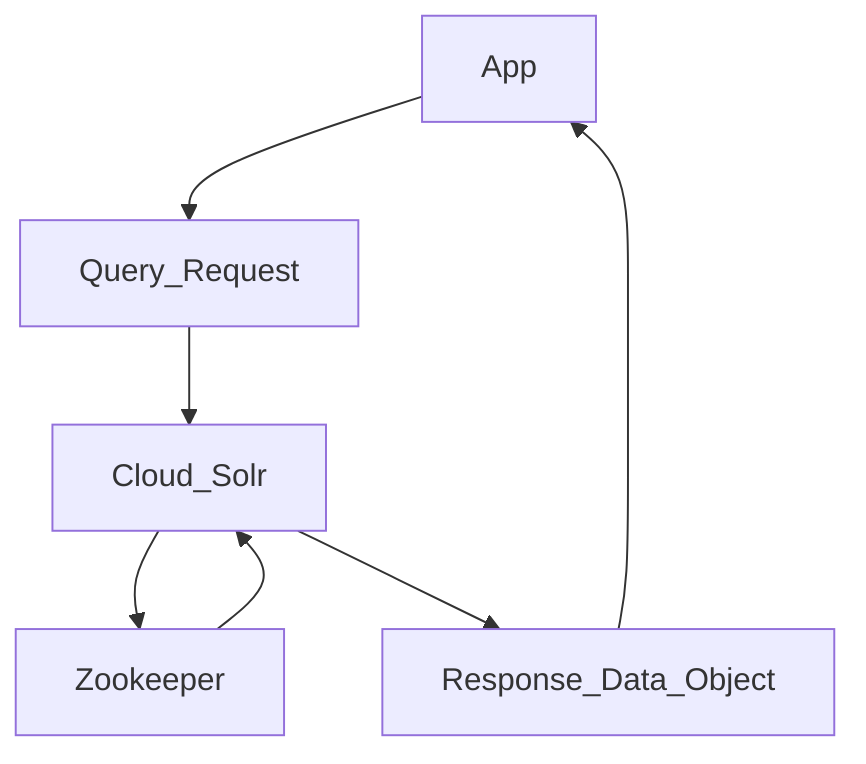

# Docker orchestration for UAL GOB (Geoblacklight) development

## Overview

This Docker orchestration runs a fully decoupled GeoBlacklight search service that uses a Blacklight (Ruby on Rails) application querying the Solr & ZooKeeper middleware "ensemble".

**How does it work? 30K ft view...**

Here's a little diagram of the GOB and Solr Cloud interaction (WIP learning Mermaid syntax):



 The GOB app container queries the Solr instance directly. "Sharding" information is managed by the ZooKeeper middleware. Using the "blacklight-core" metadata, Solr sends back its data response in a format that can be ingested by RoR models. See the [Blacklight module directory](https://github.com/projectblacklight/blacklight/tree/main/lib/blacklight/solr) for Solr class implementations.

## Setup

**1. Build the UAL-GOB Docker images (for GOB and Solr containers):**

```shell
$ ./dbuild.sh
```

**2. Start or rebuild the Docker network:**

```shell
$ ./start-me-up.sh
```

The GOB app is installed automatically if it does not already exist. This will take a little while and the server is still not started. A list of dependencies should print out as the GOB is installed. All data that matters to the app is statefully preserved on the host machine in the `./ual_gob` directory. The GOB app will be in `./ual_gob/app`.

Build scripts set up Apache ZooKeeper and Solr decoupled to propagate search configuration and data in "cloud mode". Search data is located in Docker volumes on startup.

## Optional application container commands

**Stop the Docker network:**

This is non-destructive. All containers remain stateful, as well as volumes and network.

```shell
$ ./start-me-up.sh pause
```

**Run Rake commands in the containerized application directory:**

```shell
$ docker exec -it gob-app bash -c -l './rake_command.sh "<command-to-run>"'

# Example - populate Solr test fixtures:
$ docker exec -it gob-app bash -c -l './rake_command.sh "geoblacklight:index:seed[:remote]"'
```

**Tear-down**

WARNING: This destroys _all_ data, meaning containers and volumes. (It does not remove Docker images, however.)

```shell
$ ./destroy.sh
```

## Notes

* https://geoblacklight.org/tutorial/2015/02/09/create-your-application.html#install-geoblacklight
* https://github.com/geoblacklight/geoblacklight
* https://github.com/geobtaa/geoportal-solr-config
* https://github.com/projectblacklight/blacklight
* https://solr.apache.org/guide/solr/latest/deployment-guide/zookeeper-ensemble.html
* https://github.com/docker-solr/docker-solr/tree/master/scripts

## Helpful hints

* Software versions are controlled in several files:
  * `.env` has first priority
  * `dbuild.sh` for software that is installed at build time
  * `docker-compose.yml`
* Unfortunately, the GOB Solr config has to live on the Solr instance, since it is a separate container. It is cloned there at container build time, so the container is run with it already in place. Therefore solr config code updates are necessary both in the GOB app container and the Solr container. TODO: change this to a mount if possible.
* Blacklight and GeoBlacklight are installed as Ruby modules. Various Rake tasks are found in both these module directories. Some investigation is necessary to find them, such as [GOB's tasks](https://github.com/geoblacklight/geoblacklight/blob/main/lib/tasks/geoblacklight.rake).
