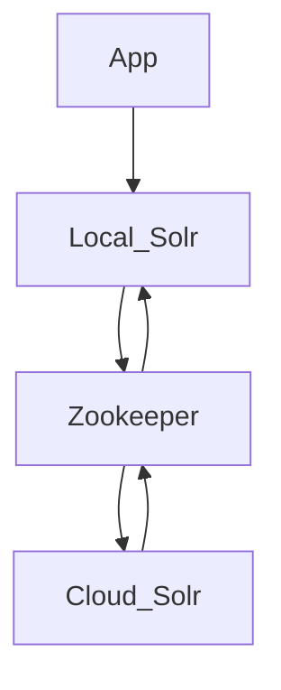

# Docker orchestration for UAL GOB (Geoblacklight) development

## Overview

Something to help me learn something about [GeoBlacklight](https://geoblacklight.org/)

**What is this?**

Here's a little diagram of GOB and Solr Cloud (WIP learning Mermaid syntax):



## Setup

**1. Build the UAL-GOB Docker image:**

```shell
$ ./dbuild.sh
```

**2. Start the Docker network:**

```shell
$ ./start-me-up.sh
```

The GOB app is installed automatically if it does not already exist. This will take a little while and the server is still not started. A list of dependencies should print out as the GOB is installed.

The templated GeoBlacklight installation then defaults to downloading and starting a Solr server locally. This Docker orchestration also sets up Apache ZooKeeper to propagate the data in "cloud mode".

__NOTE:__ This will default to a container rebuild if the docker orchestration is already present.

All data that matters to the app is statefully preserved on the host machine in the `./ual_gob` directory. The GOB app will be in `./ual_gob/app` and all the Solr files and data will be in `./ual_gob/solr`.

## Optional application container commands

**Stop the Docker network:**

This is non-destructive. All containers remain stateful, as well as volumes and network.

```shell
$ ./start-me-up.sh pause
```

**Rebuild the containers:**

This rebuilds containers, so internal data that is not persisted on a volume will be destroyed. This is necessary for changes to the `docker-compose.yml` file to take effect.

```shell
$ ./start-me-up.sh
```

**Secure the Solr network:**

If it is desired to secure the Solr servers, passing the `secure` value will cause the `cloud-secure.sh` script to run in the app container, then restart the orchestration.

```shell
$ ./start-me-up.sh secure
```

**Run Rake commands in the containerized application directory:**

```shell
$ docker exec -it gob-test bash -c -l 'cd app && ./rake_command.sh "<command-to-run>"'

# Example - populate Solr test fixtures:
$ docker exec -it gob-test bash -c -l 'cd app && ./rake_command.sh "geoblacklight:index:seed[:remote]"'
```

**Run Solr commands in the container:**

```shell
$ docker exec -it gob-test bash -c -l 'cd solr && ./solr_command.sh "<command-to-run>"'

# Example - healthcheck on the GeoBlacklight collection:
$ docker exec -it gob-test bash -c -l 'cd solr && ./solr_command.sh "healthcheck -c blacklight-core"'
```

## Notes

* https://geoblacklight.org/tutorial/2015/02/09/create-your-application.html#install-geoblacklight
* https://github.com/geoblacklight/geoblacklight
* https://github.com/geobtaa/geoportal-solr-config

## Helpful hints

Troubleshooting the Solr server is pretty easy with the logs mounted in `app/solr/server/logs`.

ATM, software versions are controlled in one of three places:

* `docker/app/Dockerfile`
* `docker/app/serve.sh`
* `docker-compose.yml`

TODO: consolidate these into one env, if possible.
