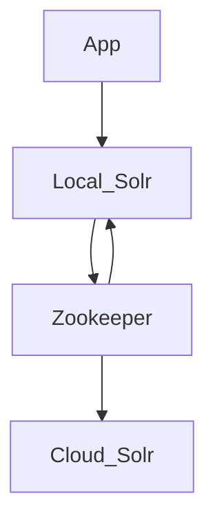

# Docker orchestration for UAL GOB (Geoblacklight) development

## Overview

Something to help me learn something about [GeoBlacklight](https://geoblacklight.org/)

**What is this?**

Here's a little diagram of GOB and Solr Cloud (WIP learning Mermaid syntax):



## Setup

**Build the Docker container:**

```shell
$ ./dbuild.sh
```

**Start the Docker network:**

```shell
$ ./start-me-up.sh
```

Startup can take a while. The container has to deploy a new RoR GOB app and install Solr. This can be sped up by making an image distro. For now, just wait a while before hitting the `destroy` button.

**Secure the cluster and admin:**

```shell
# Start Zookeeper security auth:
$ docker exec -it gob-test bash -c './secure_zk.sh'
```

User and pass are in the `docker/solr/security.json` file, as well as in the url in the `docker/app/blacklight.yml` and `.env` and `docker-compose.yml`.

The script will send the security credentials to ZooKeeper, then restart the local Solr server to propegate the changes. Application configuration 

**Change the Compose file configuration:**

To make changes to the docker-compose file, make changes, then:

```shell
$ docker compose restart
```

**Run Rake commands in the containerized application directory:**

```shell
$ docker exec -it gob-test bash -c './rake_command.sh "<command-to-run>"'

# Example - populate Solr test fixtures:
$ docker exec -it gob-test bash -c './rake_command.sh "geoblacklight:index:seed[:remote]"'
```

**Run Solr commands in the container:**

```shell
$ docker exec -it gob-test bash -c './solr_command.sh "<command-to-run>"'

# Example - healthcheck on the GeoBlacklight collection:
$ docker exec -it gob-test bash -c './solr_command.sh "healthcheck -c blacklight-core"'
```

## Notes

* https://geoblacklight.org/tutorial/2015/02/09/create-your-application.html#install-geoblacklight
* https://github.com/geoblacklight/geoblacklight
* https://github.com/geobtaa/geoportal-solr-config

## Helpful hints

Troubleshooting the Solr server is pretty easy with the logs mounted in `app/solr/server/logs`.

ATM, software versions are controlled in one of three places:

* `docker/app/Dockerfile`
* `docker/app/serve.sh`
* `docker-compose.yml`

TODO: consolidate these into one env, if possible.
