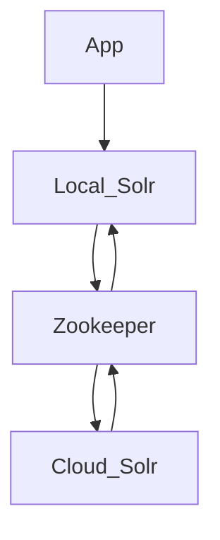

# Docker orchestration for UAL GOB (Geoblacklight) development

## Overview

Something to help me learn something about [GeoBlacklight](https://geoblacklight.org/)

**What is this?**

Here's a little diagram of GOB and Solr Cloud (WIP learning Mermaid syntax):



## Setup

**1. Build the Docker container:**

```shell
$ ./dbuild.sh
```

**2. Start the Docker network:**

```shell
$ ./start-me-up.sh
```

This will default to a container rebuild if the docker orchestration is already present.

__NOTE:__ This also installs the GOB app automatically if it does not already exist on the `ual_gob` volume.

```shell
$ docker exec -it gob-test bash -c -l 'cd app && ./install_app.sh'
```

This will take a little while and the server is still not started. A list of dependencies should print out as the GOB is installed.

**Start the server:**

The templated GeoBlacklight installation defaults to downloading and starting Solr locally. This Docker orchestration sets up ZooKeeper and one more Solr server to show how to propagate the data.

```shell
# Start the Rails application, also installing and starting the default Solr
$ docker exec -it gob-test bash -c -l 'cd app && ./serve.sh'
```

## Optional application container commands

**Secure orchestration:**

User and pass are in the `docker/solr/security.json` file, as well as in the url in the `docker/app/blacklight.yml` and `.env` and `docker-compose.yml`.

The script will send the security credentials to ZooKeeper, then restart the local Solr server to propagate the changes.

```shell
# Start Zookeeper security auth:
$ docker exec -it gob-test bash -c -l 'cd solr && ./cloud-secure.sh'
```

**Stop the Docker network:**

This is non-destructive. All containers remain stateful, as well as volumes and network.

```shell
$ ./start-me-up.sh pause
```

**Rebuild the containers:**

This rebuilds containers, so internal data that is not persisted on a volume will be destroyed. This is necessary for changes to the `docker-compose.yml` file to take effect.

```shell
$ ./start-me-up.sh
```

**Run Rake commands in the containerized application directory:**

```shell
$ docker exec -it gob-test bash -c -l 'cd app && ./rake_command.sh "<command-to-run>"'

# Example - populate Solr test fixtures:
$ docker exec -it gob-test bash -c -l 'cd app && ./rake_command.sh "geoblacklight:index:seed[:remote]"'
```

**Run Solr commands in the container:**

```shell
$ docker exec -it gob-test bash -c -l 'cd solr && ./solr_command.sh "<command-to-run>"'

# Example - healthcheck on the GeoBlacklight collection:
$ docker exec -it gob-test bash -c -l 'cd solr && ./solr_command.sh "healthcheck -c blacklight-core"'
```

## Notes

* https://geoblacklight.org/tutorial/2015/02/09/create-your-application.html#install-geoblacklight
* https://github.com/geoblacklight/geoblacklight
* https://github.com/geobtaa/geoportal-solr-config

## Helpful hints

Troubleshooting the Solr server is pretty easy with the logs mounted in `app/solr/server/logs`.

ATM, software versions are controlled in one of three places:

* `docker/app/Dockerfile`
* `docker/app/serve.sh`
* `docker-compose.yml`

TODO: consolidate these into one env, if possible.
